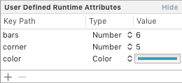

<p align="center">

<p>

<p align="center">
**Audio Indicator Bars** for **iOS**, **macOS (?)**, **watchOS** and **tvOS**
<p>

<p align="center">
Indicates for your app users which audio is playing.
<p>

<p align="center">
	[](https://github.com/LeonardoCardoso/AudioIndicatorBars#requirements-and-details)
	[](https://github.com/LeonardoCardoso/AudioIndicatorBars#cocoapods)
	[](https://github.com/LeonardoCardoso/AudioIndicatorBars#carthage)
	[](https://github.com/LeonardoCardoso/AudioIndicatorBars#swift-package-manager)
	[](https://travis-ci.org/LeonardoCardoso/AudioIndicatorBars)
<p>
<p>


#### Index 

- [Requirements and Details](#requirements-and-details)
- [Installation](#installation)
      * [CocoaPods](#cocoapods)
      * [Carthage](#carthage)
      * [Swift Package Manager](#swift-package-manager)
      * [Manually](#manually)
- [Usage](#usage)
      * [Instatiating](#instatiating)
        + [Programmatically](#programmatically)
        + [Interface Builder](#interface-builder)
      * [Actions](#actions)
        + [Start](#start)
        + [Stop](#stop)
- [Information and Contact](#information-and-contact)
- [License](#license)

<hr />

## Requirements and Details

* iOS 9.0+ / macOS 10.11+ / tvOS 9.0+ / watchOS 2.0+
* Xcode 8.0+
* Built with Swift 3.0

## Installation

### CocoaPods

To use **AudioIndicatorBars** as a pod package just add the following in your **Podfile** file.

```ruby
	source 'https://github.com/CocoaPods/Specs.git'
	platform :ios, '9.0'
	
	target 'Your Target Name' do
	  	use_frameworks!
	  	// ...
	  	pod 'AudioIndicatorBars', '~> 0.0.1'
	  	// ...
	end
```

### Carthage

To use **AudioIndicatorBars** as a Carthage module package just add the following in your **Cartfile** file.

```ruby
  	// ...
	github "LeonardoCardoso/AudioIndicatorBars" ~> 0.0.1
  	// ...
```

### Swift Package Manager

To use **AudioIndicatorBars** as a Swift Package Manager package just add the following in your **Package.swift** file.

```swift
import PackageDescription

let package = Package(
  name: "Your Target Name",
  dependencies: [
  	// ...
    .Package(url: "https://github.com/LeonardoCardoso/AudioIndicatorBars.git", "0.0.1")
  	// ...
  ]
)
```

### Manually

You just need to drop AudioIndicatorBars folder into Xcode project (make sure to enable "Copy items if needed" and "Create groups").


## Usage

### Instatiating

#### Programmatically
```swift
let indicator: AudioIndicatorBarsView =
            AudioIndicatorBarsView(
                rect: CGRect,
                barsCount: Int,
                cornerRadius: CGFloat,
                color: UIColor
        )
```

#### Interface Builder




### Actions

#### Start
```swift
indicator.start()
```

#### Stop
```swift
indicator.stop()
```


## Information and Contact

Developed by [@LeonardoCardoso](https://github.com/LeonardoCardoso). 

Contact me either by Twitter [@leocardz](https://twitter.com/leocardz) or emailing me to [contact@leocardz.com](mailto:contact@leocardz.com).


## License

    The MIT License (MIT)

	Copyright (c) 2016 Leonardo Cardoso
	
	Permission is hereby granted, free of charge, to any person obtaining a copy
	of this software and associated documentation files (the "Software"), to deal
	in the Software without restriction, including without limitation the rights
	to use, copy, modify, merge, publish, distribute, sublicense, and/or sell
	copies of the Software, and to permit persons to whom the Software is
	furnished to do so, subject to the following conditions:
	
	The above copyright notice and this permission notice shall be included in all
	copies or substantial portions of the Software.
	
	THE SOFTWARE IS PROVIDED "AS IS", WITHOUT WARRANTY OF ANY KIND, EXPRESS OR
	IMPLIED, INCLUDING BUT NOT LIMITED TO THE WARRANTIES OF MERCHANTABILITY,
	FITNESS FOR A PARTICULAR PURPOSE AND NONINFRINGEMENT. IN NO EVENT SHALL THE
	AUTHORS OR COPYRIGHT HOLDERS BE LIABLE FOR ANY CLAIM, DAMAGES OR OTHER
	LIABILITY, WHETHER IN AN ACTION OF CONTRACT, TORT OR OTHERWISE, ARISING FROM,
	OUT OF OR IN CONNECTION WITH THE SOFTWARE OR THE USE OR OTHER DEALINGS IN THE
	SOFTWARE.